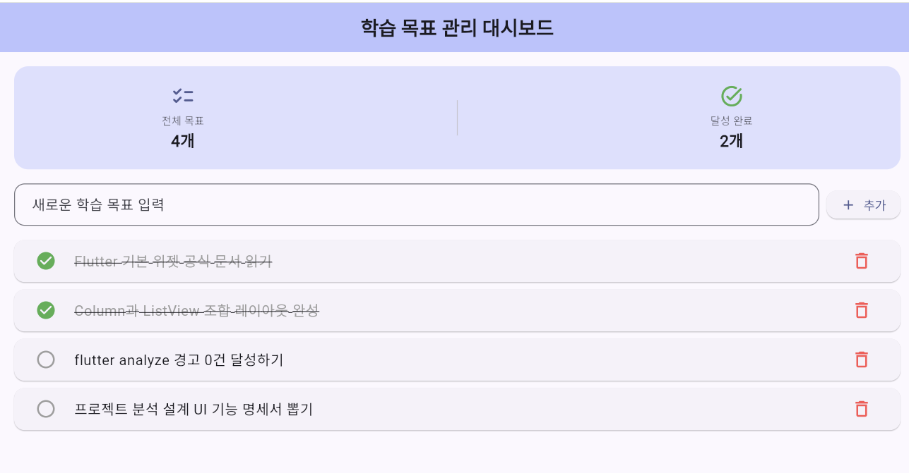
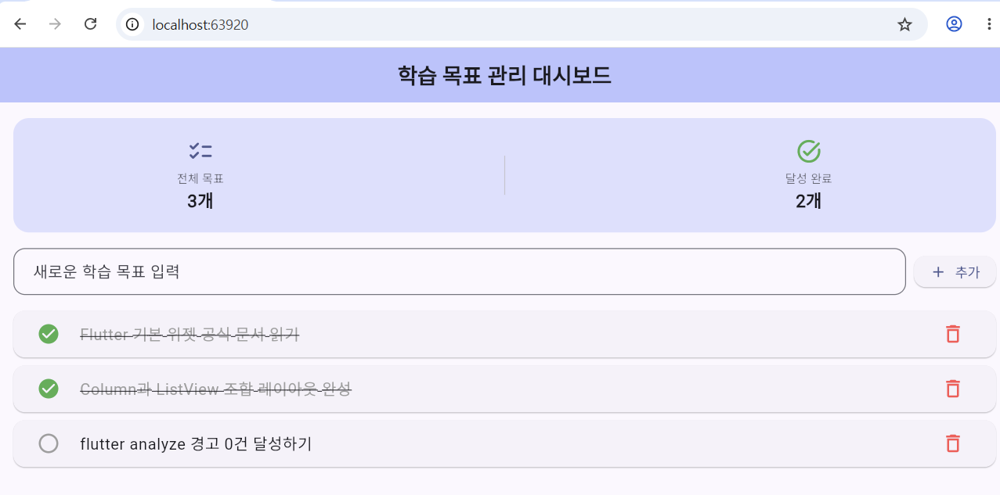
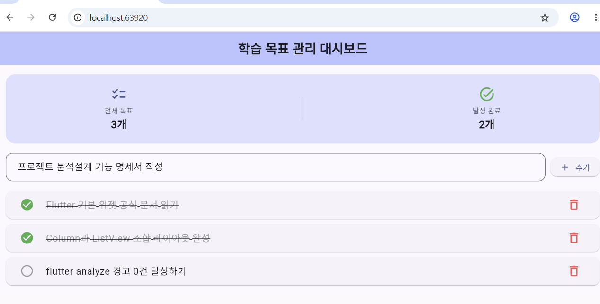
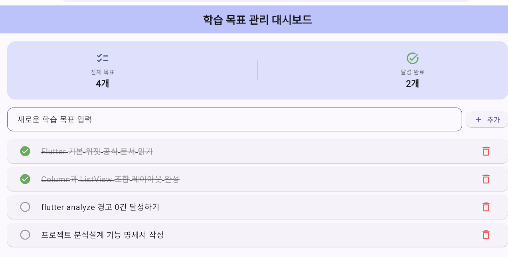
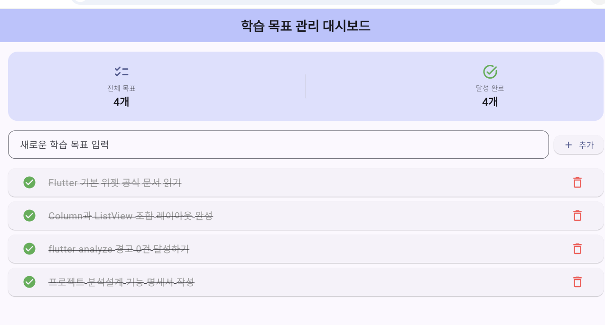
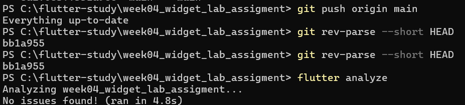

# week04_widget_lab_assigment

1. 모바일 화면
   

2. 위젯 선택표: 만들 기능, 위젯 범주, 선택한 위젯, 선택 이유

## 2. 위젯 선택표

| 만들 기능                         | 위젯 범주           | 선택한 위젯           | 선택 이유                                                                                                                       |
| :-------------------------------- | :------------------ | :-------------------- | :------------------------------------------------------------------------------------------------------------------------------ |
| **모바일 기본 화면 틀**           | 틀/구조 (Structure) | `Scaffold`, `AppBar`  | 모바일 화면의 표준 틀을 구성하고, 시스템 상단 영역에 제목을 안정적으로 배치하기 위해 사용함.                                    |
| **목표 텍스트 & 통계 수치 표시**  | 보여 주기 (Display) | `Text`                | 목표 내용과 상단 대시보드의 개수 수치를 가독성 있게 표시하고, 완료 여부에 따라 취소선 스타일을 적용하기 위해 사용함.            |
| **체크 상태 및 삭제 아이콘**      | 보여 주기 (Display) | `Icon`                | 완료/미완료 상태(`check_circle`, `radio_button_unchecked`)와 삭제 동작을 직관적인 머티리얼 심볼로 시각화하기 위해 사용함.       |
| **화면 전체 수직 정렬**           | 배치 (Layout)       | `Column`              | 상단 통계 카드, 목표 입력창, 하단 스크롤 목록을 세로 방향으로 순차 적층하기 위해 사용함.                                        |
| **통계 정보 및 입력창 가로 정렬** | 배치 (Layout)       | `Row`                 | 통계 지표 2개와 텍스트 입력창-추가 버튼을 가로 한 줄로 자연스럽게 배치하기 위해 사용함.                                         |
| **동적 목표 목록 스크롤**         | 배치 (Layout)       | `ListView.builder`    | 추가/삭제되는 목표 개수에 맞춰 오버플로우 없이 부드럽게 스크롤되며, 화면에 보이는 항목만 동적으로 렌더링하기 위해 사용함.       |
| **목록 항목 카드화**              | 배치 (Layout)       | `Card`, `ListTile`    | 각 목표를 독립된 카드로 묶고, 체크 아이콘(leading), 제목(title), 삭제 버튼(trailing)을 일정한 규격으로 정돈하기 위해 사용함.    |
| **목록 스크롤 영역 높이 확보**    | 배치 (Layout)       | `Expanded`            | `Column` 내부에서 `ListView`가 남은 화면 높이를 온전히 채우도록 하여 렌더링 크기 오류(Unbounded height)를 방지하기 위해 사용함. |
| **신규 목표 등록 실행**           | 동작 (Action)       | `ElevatedButton.icon` | 텍스트 입력 후 사용자가 명시적으로 눌러 리스트에 추가하는 주 액션 버튼으로 입체감과 터치 피드백을 제공하기 위해 사용함.         |
| **체크 토글 및 삭제 실행**        | 동작 (Action)       | `IconButton`          | 터치 영역을 확보하면서 아이콘을 눌렀을 때 즉시 상태 변경(`setState`) 및 삭제 동작이 일어나도록 하기 위해 사용함.                |
| **사용자 텍스트 입력**            | 동작 (Action)       | `TextField`           | 사용자가 추가할 목표 문장을 키보드로 직접 입력받기 위해 사용함.                                                                 |

3. 결정 근거표

## 3. 결정 근거표

| 대상 위젯              | 공식 문서 위치 (Official Docs)                                                                               | 공식 문서 직접 확인 내용                                                                                                                                                                     | 현재 화면에 적용한 이유                                                                                                                                                                         |
| :--------------------- | :----------------------------------------------------------------------------------------------------------- | :------------------------------------------------------------------------------------------------------------------------------------------------------------------------------------------- | :---------------------------------------------------------------------------------------------------------------------------------------------------------------------------------------------- |
| **`Scaffold`**         | [api.flutter.dev > Scaffold class](https://api.flutter.dev/flutter/material/Scaffold-class.html)             | 머티리얼 디자인의 기본 시각적 레이아웃 구조를 구현하며, `appBar`, `body`, `floatingActionButton` 등의 전용 슬롯을 관리하고 기기 노치 및 시스템 UI 영역을 침범하지 않도록 안전한 틀을 제공함. | 모바일 화면의 표준 규격을 설정하고, 상단 헤더(`appBar`)와 본문 영역(`body`)을 안전하고 정돈된 규격으로 분리하기 위해 화면 최상단 루트 위젯으로 채택함.                                          |
| **`AppBar`**           | [api.flutter.dev > AppBar class](https://api.flutter.dev/flutter/material/AppBar-class.html)                 | 주로 화면 상단에 위치하는 툴바로, `title`, `leading`, `actions`, `backgroundColor` 등을 지원하며 기기 상태 표시줄(Status Bar) 높이를 자동으로 계산하여 배치함.                               | 현재 앱이 '학습 목표 관리 대시보드'임을 사용자에게 직관적으로 알리기 위한 중앙 정렬 타이틀과 앱 테마 컬러를 통일감 있게 노출하기 위해 적용함.                                                   |
| **`Column`**           | [api.flutter.dev > Column class](https://api.flutter.dev/flutter/widgets/Column-class.html)                  | 자식 위젯들을 수직(세로) 방향으로 배치하며, `mainAxisAlignment`와 `crossAxisAlignment`로 정렬을 제어함. 기본적으로 수직 공간을 무한히 차지하지 않고 가용 높이 내에서 자식들을 적층함.        | 상단 요약 카드 ➔ 목표 입력창 ➔ 스크롤 리스트가 세로 방향으로 자연스럽게 위에서 아래로 흐르는 정보 계층을 구성하기 위해 메인 레이아웃의 뼈대로 채택함.                                           |
| **`Row`**              | [api.flutter.dev > Row class](https://api.flutter.dev/flutter/widgets/Row-class.html)                        | 자식 위젯들을 수평(가로) 방향으로 배치하며, 유연한 너비 분배를 위해 내부에서 `Expanded` 위젯과 조합하여 사용됨.                                                                              | 1) 상단 통계 카드에서 '전체'와 '완료' 수치를 양옆으로 균등 배치하고, 2) 텍스트 입력창과 [추가] 버튼을 한 줄에 나란히 정렬하기 위해 적용함.                                                      |
| **`ListView.builder`** | [api.flutter.dev > ListView.builder](https://api.flutter.dev/flutter/widgets/ListView/ListView.builder.html) | 화면에 보이는(또는 근접한) 항목만 온디맨드(on-demand)로 빌드하는 `IndexedWidgetBuilder`를 사용하므로, 항목 수가 가변적이거나 많은 목록에서 메모리를 매우 효율적으로 재사용함.                | 목표 리스트가 동적으로 추가/삭제되며 개수가 늘어날 때 화면을 벗어나도 오버플로우 에러 없이 부드러운 스크롤을 보장하고 렌더링 성능을 최적화하기 위해 적용함.                                     |
| **`Expanded`**         | [api.flutter.dev > Expanded class](https://api.flutter.dev/flutter/widgets/Expanded-class.html)              | `Flex`, `Row`, `Column`의 자식을 감싸 남은 여유 공간을 채우도록 강제(`flex: 1` 기본값)하며, 자식 위젯이 무한 크기 오류를 내지 않도록 제약(Constraint)을 전달함.                              | `Column` 안에 스크롤 위젯인 `ListView`를 배치할 때 발생하는 크기 제약 충돌(`RenderFlex unbounded height`) 에러를 방지하고, 리스트 영역이 화면의 남은 높이를 온전히 차지하도록 하기 위해 적용함. |
| **`Text`**             | [api.flutter.dev > Text class](https://api.flutter.dev/flutter/widgets/Text-class.html)                      | 단일 스타일의 텍스트 문자열을 렌더링하며, `TextStyle`을 통해 글꼴 크기, 굵기, 색상, 그리고 취소선(`TextDecoration.lineThrough`) 등의 텍스트 장식을 지정할 수 있음.                           | 목표 문구와 통계 숫자를 명확히 표시하고, 완료 토글 시 취소선과 연한 회색 컬러를 적용해 직관적인 완료 상태 피드백을 전달하기 위해 적용함.                                                        |
| **`Icon`**             | [api.flutter.dev > Icon class](https://api.flutter.dev/flutter/widgets/Icon-class.html)                      | 머티리얼 심볼 폰트를 사용해 그래픽 글리프를 표시하는 위젯으로, 벡터 기반이라 해상도 깨짐 없이 크기(`size`)와 색상(`color`)을 자유롭게 조절할 수 있음.                                        | 전체 목표 서류 아이콘, 체크 완료 초록 아이콘, 미완료 빈 원, 삭제 휴지통 아이콘 등 텍스트보다 빠른 시각적 인지를 유도하기 위해 적용함.                                                           |
| **`ElevatedButton`**   | [api.flutter.dev > ElevatedButton class](https://api.flutter.dev/flutter/material/ElevatedButton-class.html) | 머티리얼 표면 위에 입체감(Elevation/그림자)을 가지고 떠 있는 버튼으로, `onPressed` 콜백을 통해 사용자의 탭 인터랙션을 감지하고 물결(Ink ripple) 효과를 제공함.                               | 사용자가 텍스트를 입력한 후 명확하게 실행해야 하는 주 동작(Primary Action)인 '목표 추가' 기능을 시각적으로 도드라지게 표현하고 클릭 피드백을 주기 위해 적용함.                                  |
| **`IconButton`**       | [api.flutter.dev > IconButton class](https://api.flutter.dev/flutter/material/IconButton-class.html)         | 머티리얼 `Icon`을 눌렀을 때 반응하도록 감싼 위젯으로, 모바일 터치 접근성 표준 규격(최소 48x48 픽셀)의 히트 영역을 자동 확보해 줌.                                                            | 리스트 아이템 내부에서 체크박스 토글과 삭제 버튼을 컴팩트하게 배치하면서도, 손가락 터치 시 오작동 없이 즉시 `setState`가 트리거되도록 하기 위해 적용함.                                         |

4. ac1~ac3 화면

   i ac1(초기 진입 화면)
   

   ii ac2
   

   iii ac3
   

   iv ac4
   

5. ## 5. `flutter analyze` 결과와 Git commit ID

git commit id : c3c49bf
